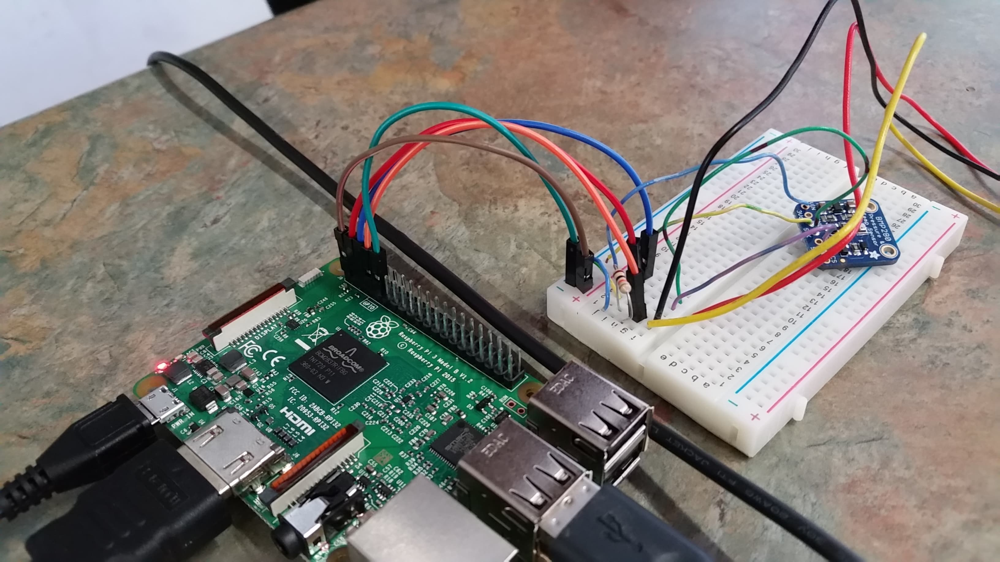

# ASAB Weatherstation Guide
Disclaimer: This guide is written by Henry, who mostly worked on software (and even then, most of this was done 2 years ago at the time of writing this). 
It should be updated as new members go through it again.

## Hardware
### Sensors
Currently, we have the DHT22 temperature and humidity sensor and the BME280 temperature and pressure sensor hooked up. 
The BME280 is superior to the DHT22 when it comes to temperature readings, so we opt to use that one in our data analysis.
We followed [this](https://www.youtube.com/watch?v=IHTnU1T8ETk) guide to hook up the DHT22, using the `pigpio` method (see Software).
I don't remember how we did the BME280 sensor.
Our current setup looks like this:



For more help, perhaps consult this (outdated) image:


### Other
You will also need the following hardware pieces for a pi:
- Breadboard and wires.
- MicroSD card to store the OS and all data.
- Keyboard, mouse, monitor, and HDMI-to-VGA cable for non-remote tinkering.

## Software
### Operating System (OS)
Raspberry Pis run on Linux, and we like a particular OS called Raspian (based on Debian which is where Ubuntu comes from).
First, you must install the Raspian OS on a MicroSD; you can download a `.iso` file of the OS [here](https://www.raspberrypi.org/downloads/raspbian/) which also has a link to their installation guide.
Once this is done, put the MicroSD in its slot and fire the Pi up (while it is hooked up to a mouse, keyboard, and monitor).
You should see a login screen.
The default username and password is `pi` and `raspberry`, respectively. 
Change these as desired (just type `passwd` into a terminal).

### Update Software
Raspbian uses the `apt` package manager to keep install, remove, and update software.
You should do this regularly (especially on the first login!):
```
apt update; apt upgrade
```
This of course assumes you have internet. 
AirBears2 might not play nice with the default network manager, so try CalVisitor or go to someone's house.

### Install Software
These are the packages and details I remember, but many things may be missing!

If the network is giving you trouble, try installing the better network manager with `sudo apt install network-manager`.
`sudo` just means you are doing something intense and need to provide the password. 
If I recall, this was a major headache for me the first time, as I also had to disable the old network manager . . . Good luck!
You're going to want a text editor that you can use in the terminal. 
`nano` will work in a pinch, but I recommend `vim` for the long term.
Open a terminal and install the packages you will need with, e.g. `sudo apt install vim`. 

You will also need `pip`, the Python package manager, `sudo apt install python-pip python3-pip`.
Also, we found that in order to have `numpy`, a Python package, work properly on a Raspberry Pi, we had to run `sudo apt install libatlas-base-dev`

Install `PiGPIO` as in the video above so that we can communicate with our sensors.
Run `sudo systemctl enable pigpiod` so that the PiGPIO daemon starts on start-up.

Next install `git` (`sudo apt install git`) and then this repository - finally!
Here is how `git` will roughly work:

- Install the repo:
```
git clone https://github.com/berkeleyatmos/weatherstation
```
- Say you edit things in the repo. To save the changes, do
```
git add *
git commit -m "we did things A, B, and C"
git push origin master
```
- Say your computer's version of the repo is out of date. To update it to the latest commit, do
```
git pull
```
And that should get you pretty far.
Next, install the Python requirements for this repo:
```
pip install -r requirements.txt
```
You may need to do this for both `pip` and `pip3`, I can't remember. 
If things crash, maybe just uninstall those packages in `requirements.txt` and do them one at a time manually with `pip install <package_name>` . . .
To see if everything worked, run `weatherstation/save_data.py` and see what happens.
You may need to run `sudo pigpiod` if this is still the first login.
Good luck!

## WiFi Login
We don't want to be using a monitor all the time if we can help it. 
The point is the have the Pi be a server at the top of a building or something - you can't always go see it in person!
To access it remotely, we use `ssh`. 

Unfortunately, the station's IP address seems to change every few reboots when it is on Airbears2.
This means we have to hook up the Pi to a monitor and check its IP manually: on the Pi, run `ifconfig` and look for the `inet` line under `wlan0` to get the IP.
Then run `ssh pi@<ip_address>` on your own machine and you should be in (with the proper password).
